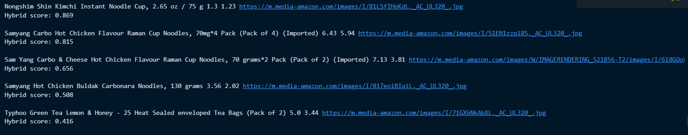
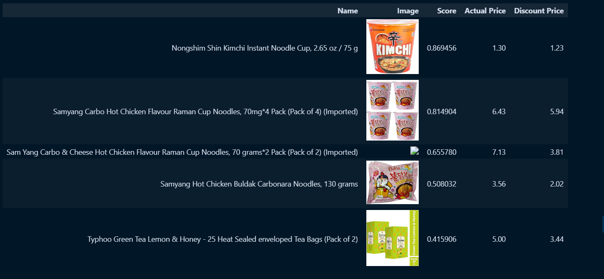

# 🎯 Recommender System Project

A **multi-approach recommendation system** that leverages **traditional, hybrid, and LLM-based techniques** to deliver accurate and personalized suggestions.  

This system analyzes **user interactions, preferences, and contextual data** to generate meaningful recommendations across different domains.

---

# 📌 Overview

Recommendation systems are widely used in:

- 🛒 E-commerce platforms  
- 🎬 Streaming services  
- 📱 Social media  

However, traditional systems often face challenges such as:

- Cold-start problem  
- Limited personalization  
- Lack of contextual understanding  

This project addresses these issues by implementing:

- Traditional recommendation techniques  
- Hybrid models for improved accuracy  
- LLM-based systems for context-aware recommendations  

---

# 🎯 Objectives

The primary goals of this project are:

- Build a **multi-approach recommendation system**  
- Compare **traditional, hybrid, and LLM-based methods**  
- Improve recommendation accuracy and personalization  
- Handle **cold-start and sparse data problems**  
- Enable **context-aware recommendations using LLMs**  
- Analyze performance across different techniques  

---

# ⚙️ System Architecture

The system consists of the following components:

- Data preprocessing module  
- Collaborative filtering engine  
- Content-based filtering engine  
- Hybrid recommendation layer  
- LLM-based recommendation module  
- Evaluation and comparison module  

Each module contributes to generating and evaluating recommendations effectively.

---

# 🧠 Working Principle

1. **Data Collection**
   - User-item interaction data is gathered  

2. **Preprocessing**
   - Data is cleaned and structured  

3. **Traditional Recommendation**
   - Collaborative and content-based filtering applied  

4. **Hybrid Model**
   - Combines outputs from multiple techniques  

5. **LLM-based Recommendation**
   - Uses contextual and textual understanding  

6. **Prediction Generation**
   - Final recommendations are generated  

7. **Evaluation**
   - Performance is measured and compared  

---

# 🔌 System Components

| Component | Description |
|----------|------------|
| Collaborative Filtering | User/item similarity-based recommendations |
| Content-Based Filtering | Item feature-based recommendations |
| Hybrid System | Combines multiple approaches |
| LLM Module | Context-aware recommendation engine |
| Dataset | User-item interaction data |
| Evaluation Module | Measures system performance |

---

# 📊 Block Diagram

The following diagram represents the architecture of the recommendation system.



---

# 🔧 Pipeline Flow

The recommendation pipeline includes:

- Data preprocessing  
- Feature extraction  
- Model training  
- Recommendation generation  
- Performance evaluation  

This ensures **accurate, scalable, and personalized recommendations**.

---

# 🧮 Software Algorithm

The algorithm follows these steps:

1. Data Loading  
2. Data Preprocessing  
3. Feature Extraction  
4. Model Selection  
5. Training (Collaborative / Content-based)  
6. Hybrid Combination  
7. LLM Processing  
8. Recommendation Generation  
9. Evaluation  

---

# 📈 System Flowchart

This flowchart represents the complete workflow of the recommendation system.



---

# 💻 Implementation

The system is implemented using:

- Python  
- Jupyter Notebook  
- Machine Learning libraries  
- LLM APIs (for advanced recommendations)  

---

# 📂 Project Structure

```
recommender-system
│
├── recommender-system.ipynb
├── requirements.txt
├── README.md
├── data/
├── models/
└── images/
```

# 🚀 Applications

- Personalized product recommendations  
- Movie and content recommendation systems  
- Music recommendation platforms  
- E-learning content suggestions  
- Social media feed ranking  

---

# 📊 Results

- **Traditional Methods** → Basic accuracy, limited personalization  
- **Hybrid Methods** → Improved accuracy and robustness  
- **LLM-based Methods** → Best performance with context awareness  

---

# 🔮 Future Improvements

Possible enhancements include:

- Real-time recommendation system  
- Integration with live user data  
- Advanced deep learning models  
- Scalable deployment (cloud-based)  
- Explainable AI recommendations  
- Multi-modal recommendation (text + images)  

---

# 👨‍💻 Author

**Gagandeep Singh**  

Computer Science Student  
Interested in Artificial Intelligence, Machine Learning, and System Design.

---

# ⭐ Support

If you find this project useful, consider giving it a ⭐ on GitHub.
